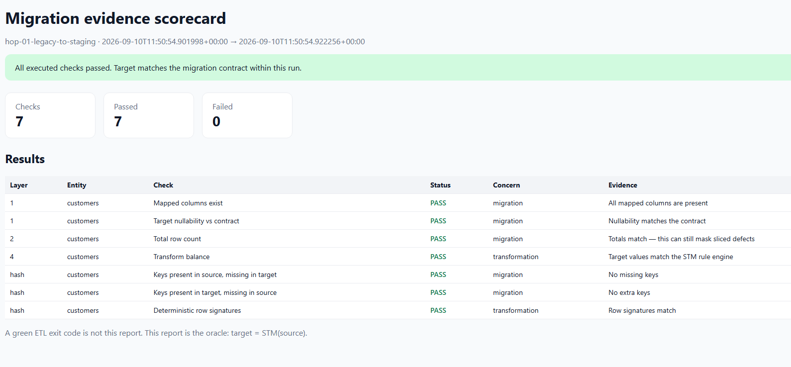
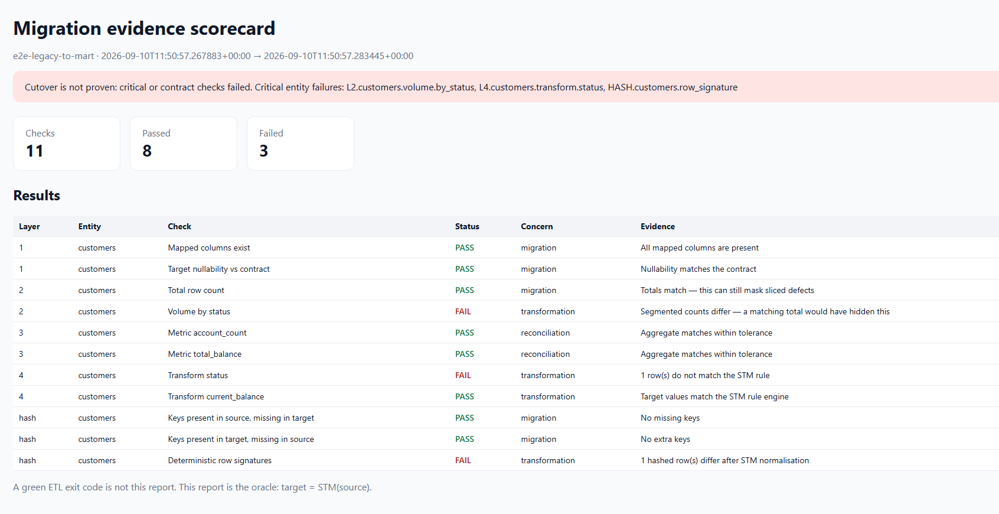
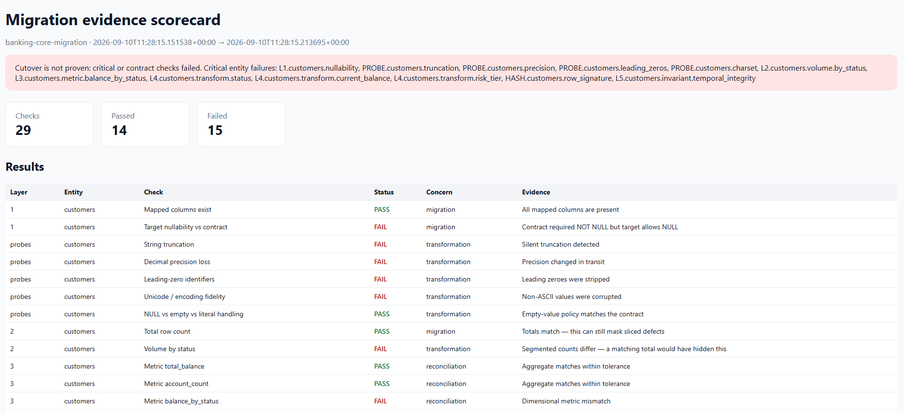

# Building the Proof: A Walkthrough of `migrate-prove`

[ARTICLE.md](ARTICLE.md) says that a green ETL job proves nothing about data correctness, and goes into the five-layer validation model built on an explicit contract. This is the "companion piece": a walkthrough of an actual tool (by no means comprehensive of every single possible combination) that implements it, and the demo that shows it catching a defect that a `COUNT(*)` check would wave through.

> This is not an API reference. It is a tour of the moving parts, in the order you would meet them if you cloned the repository, ran the demo, and then went looking for how each claim from the article is actually enforced in code.

---

## 1. The shape of the tool

```
STM YAML (contract)
        │
        ▼
┌─────────────────────────────────────┐
│  ValidationEngine                   │
│  1 Schema  2 Volume  3 Metrics      │
│  4 Transforms  HASH  5 Invariants   │
│  + failure-mode probes              │
└─────────────────────────────────────┘
        │
        ▼
 JSON + HTML evidence scorecard
 tagged: migration | transformation | reconciliation
```

`migrate-prove` is a small Python package (`src/migrate_prove/`) with one job: take a Source-to-Target Mapping written as YAML, connect to a source and a target database via SQLAlchemy, and run the five-layer model from the article against them - then emit a scorecard rather than a boolean.

The pieces map directly onto the article's sections:

| Article section | Code |
| --- | --- |
| 1 The migration contract | [`contract.py`](src/migrate_prove/contract.py), [`models.py`](src/migrate_prove/models.py) |
| 2 Five-layer validation | [`checks.py`](src/migrate_prove/checks.py), [`engine.py`](src/migrate_prove/engine.py) |
| 3 Row-level hashing | [`hashing.py`](src/migrate_prove/hashing.py) |
| 4 Risk-calibrated sampling | `sample:` block on each entity, [`sampling.py`](src/migrate_prove/sampling.py) |
| 5 Known failure modes | `failure_probes:` in the contract, evaluated in `checks.py` |
| 6 Migration/transformation/reconciliation tags | `concern` tagging on every `CheckResult` |
| 8 Automated pipeline + scorecard | [`engine.py`](src/migrate_prove/engine.py), [`reporting.py`](src/migrate_prove/reporting.py) |

The rest of this document walks through building and running the demo end to end, then reading the evidence it produces.

---

## 2. The contract is a YAML file

The article insists the STM must be *executable*, rather than an Excel sheet nobody re-reads after week one. In this codebase that means one file: [`examples/banking_demo/stm.yaml`](examples/banking_demo/stm.yaml).

An entity in that file carries everything the five layers need to check it:

```yaml
entities:
  - name: customers
    source_table: Customer
    target_table: customers
    business_key: [customer_id]
    risk: critical
    failure_probes:
      - truncation
      - precision
      - leading_zeros
      - charset
      - null_empty_literal
    volume_slices:
      - [status]
    mappings:
      - source: Status
        target: status
        kind: transform
        lookup:
          A: Active
          S: Suspended
          C: Closed
    metrics:
      - name: total_balance
        source_sql: SUM(Balance)
        target_sql: SUM(current_balance)
        tolerance_abs: 0.0001
    invariants:
      - name: temporal_integrity
        kind: temporal
        columns: [created_at, updated_at]
        expect: 0
```

Reading that against the article's mapping-dimension table (direct projections, transformations, type coercions, nullability, cardinality, surrogate keys) and we'll see that every row has a home: `mappings.kind: direct|transform|coerce`, `failure_probes`, `volume_slices`, `business_key`. `risk: critical` is the risk-calibration from #4 - basically it decides sampling strategy and which failures get called out on the HTML scorecard as blocking.

`migrate-prove compile examples/banking_demo/stm.yaml` does nothing more than load this file through [`load_contract()`](src/migrate_prove/contract.py) and confirm it parses into valid `Entity` objects (a cheap, fast sanity check before you ever touch a database).

A suite file is the second half of the contract: which contract, and which two databases.

```yaml
# examples/banking_demo/suite.yaml
name: banking-core-migration
contract: stm.yaml
source: { url: sqlite:///source.db }
target: { url: sqlite:///target.db }
output_dir: artifacts
```

Secrets never live here, obviously (see the README's `${VAR}` expansion via [`secrets.py`](src/migrate_prove/secrets.py)) but for the demo, SQLite needs none.

---

## 3. Seeding a demo with a defect that totals can't see

Whilst in the article we have an example of 1,000,000 customers where 50,000 `Closed` accounts get misclassified as `Active` yet the grand total stays put, the demo does the same thing at a scale you can read at a scale that works: [`demo/banking.py`](src/migrate_prove/demo/banking.py) seeds twelve customers into two SQLite databases, `source.db` (legacy shape: `Customer`, `CustID`, `Status` as `A`/`S`/`C`) and `target.db` (migrated shape: `customers`, `customer_id`, `status` as `Active`/`Suspended`/`Closed`).

Buried in that seed function is exactly one line that recreates the article's scenario:

```python
if cust_id == "C005":
    mapped_status = "Active"   # planted defect: source says Closed
```

`C005` is `Closed` in the source. The migration should map it to `Closed` in the target. Instead it lands as `Active`. Row counts on both sides are still 12/12 - nothing about `COUNT(*)` reveals this.

The seed function plants several other defects at the same time, each aimed at one of the article's #5 failure modes:

| Customer | Defect planted | Article failure mode |
| --- | --- | --- |
| `C005` | `Closed` → `Active` | Status misclassification (masked by totals) |
| `C008` | 49-char name silently cut to 40 | Type truncation |
| `C009` | Postcode `01234` → `1234` | Leading-zero loss |
| `C010` | `9999999.9999` rounded to `9999999.99` | Decimal precision loss |
| `C011` | `München Holdings` → `Munchen Holdings` | Character-set corruption |
| `C012` | Risk tier forced to `LOW` despite unknown default history | Transformation rule violation |

To run it:

```powershell
migrate-prove seed-demo examples/banking_demo
migrate-prove compile examples/banking_demo/stm.yaml
migrate-prove run examples/banking_demo/suite.yaml
```

---

## 4. Watching the five layers actually run

[`engine.py`](src/migrate_prove/engine.py) drives the layers in a fixed order that mirrors the article's pipeline diagram:

```python
LEVEL_ORDER = ["1", "probes", "2", "3", "4", "hash", "5"]

LEVEL_TITLES = {
    "1": "Level 1 - Structural & schema",
    "2": "Level 2 - Volume & cardinality",
    "3": "Level 3 - Metric & financial reconciliation",
    "4": "Level 4 - Transformation rules",
    "hash": "Row-level cryptographic reconciliation",
    "5": "Level 5 - Business invariants",
}
```

For each entity, [`checks.py`](src/migrate_prove/checks.py) runs the corresponding check function (`check_schema`, `check_volume`, `check_metrics`, `check_transforms`, `check_row_hashes`, `check_invariants`) and returns a list of `CheckResult` objects. Every result carries a `level`, a `concern` (`migration` / `transformation` / `reconciliation` - the exact three-way split from #6 of the article), and a pass/fail `status`.

Against the demo data, here's what each layer actually reports:

- **Level 1 (schema):** PASS. Both `Customer`/`customers` tables exist with the mapped columns present. Structure was never the problem.
- **Probes:** FAIL on `truncation` (`C008`), `leading_zeros` (`C009`), `precision` (`C010`), `charset` (`C011`) - each one a targeted search for a known failure mode, not a happy-path check.
- **Level 2 (volume):** total customer count 12/12 - **PASS**. Sliced by `status`, `Closed` shows 2 in source-mapped terms vs 1 in target - **FAIL**. This is the article's masked-error table reproduced literally.
- **Level 3 (metrics):** `total_balance` sums within tolerance - mostly PASS, since misclassifying status doesn't move money.
- **Level 4 (transforms):** the `Status` lookup rule run against every source row disagrees with the target value for `C005` - **FAIL**. The `risk_tier` rule also disagrees for `C012` - **FAIL**.
- **Hash:** row-level SHA-256 signatures (see [`hashing.py`](src/migrate_prove/hashing.py)) diverge for every row with a planted defect, because the hash is computed over normalised field values, not just the business key. Six mismatches surface here even though no rows are missing or extra.
- **Level 5 (invariants):** `temporal_integrity` checks `created_at <= updated_at`; `no_orphan_items` checks every `order_item` has a parent `order`. Both PASS in this dataset - the defects planted are transformation bugs, not referential ones.

> The demo is deliberately built so that **volume and transform layers fail while schema and invariants pass**, because that is the diagnostic power the article argues for in #6. A single boolean would tell you "migration failed." The scorecard tells you *which* concern is broken (here, `transformation`, not `migration` or `reconciliation`).

---

## 5. Reading the evidence, not the exit code

`migrate-prove run` writes both `report.json` and `report.html` via [`reporting.py`](src/migrate_prove/reporting.py), then prints a console summary and exits `1` if anything failed. Open [`examples/banking_demo/artifacts/report.html`](examples/banking_demo/artifacts/report.html):

- A **passing total row count** sits right next to a **failing sliced volume check** - the exact contradiction the article uses to make its case that global counts are not proof.
- Failures are grouped and colour-tagged by `concern`, so a reviewer scanning the report can immediately tell a dropped-rows problem from a bad-lookup problem from a source-data-integrity problem (article #6's three-way split).
- `risk: critical` entities (here, `customers`) have their failures surfaced first - the risk calibration from #4 isn't just a sampling strategy, it also drives what a reviewer sees at the top of the page.

This file is the artefact the article's #9 argues for: not "the pipeline exited 0," but a reproducible, versionable scorecard a QA lead can attach to a sign-off ticket.

---

## 6. Extending the demo: hops vs. end-to-end

The article's #6 and the companion [ASSURANCE.md](ASSURANCE.md) make a second, very important point: hop-by-hop contracts at each pipeline boundary can all pass while the finalised source → target contract still fails, because errors introduced early can be silently preserved (or compounded) downstream. `migrate-prove` ships a second demo purely to make that concrete: [`examples/hops_vs_e2e`](examples/hops_vs_e2e).

```
legacy_customer ──hop_01 (PASS)──► staging_customer ──hop_02 (PASS)──► mart_customer
        │                                                                  ▲
        └───────────── e2e full STM (FAIL: status misclassified) ─────────┘
```

```powershell
migrate-prove seed-hops-demo examples/hops_vs_e2e
migrate-prove run examples/hops_vs_e2e/suites/hop_01.yaml   # exit 0
migrate-prove run examples/hops_vs_e2e/suites/hop_02.yaml   # exit 0
migrate-prove run examples/hops_vs_e2e/suites/e2e.yaml      # exit 1
```

`hop_01.yaml` and `hop_02.yaml` are 'thin' contracts scoped to one boundary each - they only check the rules that boundary owns, per the article's "hop depth" table. `e2e.yaml` points at the full [`e2e_legacy_to_mart.yaml`](examples/hops_vs_e2e/contracts/e2e_legacy_to_mart.yaml) contract and asserts the whole legacy → mart business claim. Every hop reports green; the end-to-end suite fails on exactly the same kind of sliced-volume/transform mismatch as the banking demo. 

### Hop report


### E2E report


---

## 7. What this demo does *not* claim to prove

Hey, it's worth being honest about scope, since the article is explicit about risk calibration and production realism (#4, #7):

- Hashing runs **in-process** against SQLite (`hashing.py`) is fine for a demo, not yet SQL-pushdown against a warehouse (the README lists dialect hash pushdown as the next connector increment).
- Sampling strategy on each entity is currently `full` or a simple `stratified` block (`sampling.py`) and the article's richer stratified sampling table (HNW / recent / edge strata) is a design target, not a fully realised feature yet.
- There is no rehearsal-profile automation (synthetic → prod-replica → dress-rehearsal) as described in the article's #7 - that's a roadmap item, not something this demo exercises.

The point of the demo isn't to claim the tool is production-hardened for petabyte-scale cutovers. It's to prove the *shape* (contract as oracle, five layers, tagged concerns, evidence over exit codes) actually executes against real data and catches a real, masked defect.

---

## Try it yourself :)

```powershell
python -m venv .venv
.venv\Scripts\Activate.ps1
python -m pip install --upgrade pip
python -m pip install -e ".[dev]"

migrate-prove seed-demo examples/banking_demo
migrate-prove compile examples/banking_demo/stm.yaml
migrate-prove run examples/banking_demo/suite.yaml
```

Then open `examples/banking_demo/artifacts/report.html` and look for the row where total volume passes and sliced volume fails.

